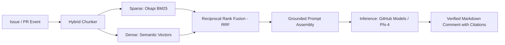

# ⚡ Hybrid RAG GitHub Action

[](https://github.com/marketplace/actions/hybrid-rag-assistant)
[](LICENSE)
[](package.json)
[](test/retrieval.test.js)

A production-grade, context-grounded GitHub Action that automatically answers **Issues**, **Pull Requests**, and **Discussions** using a state-of-the-art **Hybrid RAG (BM25 + Dense Semantic Vector Search + Reciprocal Rank Fusion)** architecture.

---

## 🏛️ Architecture Overview



### 💎 Key Features
* **Zero-Container Overhead:** Executes natively on `node20` in under 3 seconds.
* **Hybrid Search Engine:** Combines exact keyword matching (Okapi BM25) with dense semantic similarity (Cosine Distance).
* **Reciprocal Rank Fusion (RRF):** Merges multi-modal rankings deterministically via $RRF(d) = \sum \frac{w_m}{k + r_m(d)}$.
* **Structural Chunking & Exact Citations:** Maps every answer back to specific file line ranges (`[file.md#L10-L35]`).
* **Pluggable Inference:** Works seamlessly with **GitHub Models API** (`Phi-4`, `gpt-4o-mini`), Azure AI, or local SLMs.

---

## 🚀 Quickstart & Workflow Setup

Create a workflow file at `.github/workflows/hybrid-rag-assistant.yml`:

```yaml
name: 🤖 Hybrid RAG Repository Assistant

on:
  issues:
    types: [opened]
  issue_comment:
    types: [created]
  pull_request:
    types: [opened]

permissions:
  contents: read
  issues: write
  pull-requests: write

jobs:
  assist:
    runs-on: ubuntu-latest
    steps:
      - name: 📥 Checkout Repository Context
        uses: actions/checkout@v4

      - name: ⚡ Run Hybrid RAG Assistant
        uses: Cagrik34/hybrid-rag-action@v1
        with:
          github-token: ${{ secrets.GITHUB_TOKEN }}
          docs-path: 'docs,README.md,CONTRIBUTING.md'
          query-trigger: 'auto'
          llm-provider: 'github-models'
          model-name: 'Phi-4'
```

---

## ⚙️ Inputs Configuration

| Input | Description | Required | Default |
| :--- | :--- | :---: | :---: |
| `github-token` | GitHub authentication token with issues/PRs write permissions. | **Yes** | `${{ github.token }}` |
| `docs-path` | Comma-separated paths or directories to index. | No | `docs,README.md,CONTRIBUTING.md` |
| `query-trigger` | Trigger word (`auto` for all, or e.g. `@assistant`). | No | `auto` |
| `llm-provider` | Inference backend (`github-models`, `openai`, `custom`). | No | `github-models` |
| `model-name` | Model identifier (e.g. `Phi-4`, `gpt-4o-mini`). | No | `Phi-4` |
| `top-k` | Number of fused passages to provide in LLM context. | No | `5` |
| `rrf-k` | RRF smoothing constant. | No | `60` |

---

## 🧪 Local Verification & Tests

Run the test suite locally:

```bash
npm test
```

---

## 📄 License
Released under the [MIT License](LICENSE). Built with ❤️ by [Çağrı Giray Keşan](https://github.com/Cagrik34).
